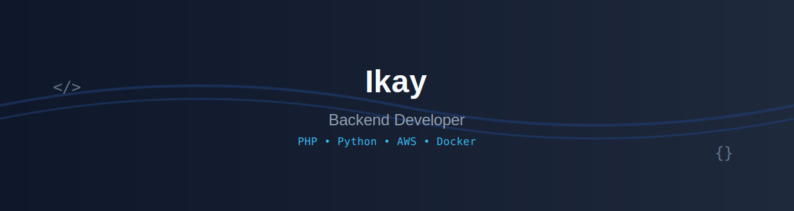

# 👨‍💻 Welcome to My GitHub Profile

  

  
  

## 🚀 About Me

I'm a passionate Backend Developer with expertise in building robust and scalable applications. I specialize in PHP and Python development, with a strong foundation in cloud technologies and DevOps practices.

- 🔭 I'm currently working on backend development projects
- 🌱 I'm constantly learning and improving my skills in cloud technologies
- 💬 Ask me about PHP, Python, AWS, or Docker
- 🎯 Focused on creating efficient and scalable backend solutions

## 🛠️ Tech Stack

<table>
<tr>
<td valign="top" width="33%">

### Frontend

</td>
<td valign="top" width="33%">

### Backend

</td>
<td valign="top" width="33%">

### DevOps

</td>
</tr>
</table>

## 📊 GitHub Stats

  

  

## 🏆 GitHub Trophies

  

## 🤝 Connect with me

  
  
  
  
  
  

---

  <i>⚡ Happy coding! Let's build something amazing together! 🚀</i>

